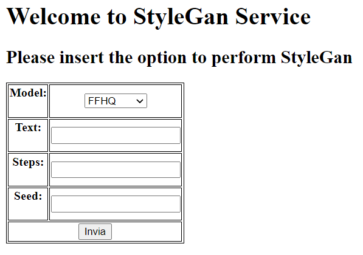
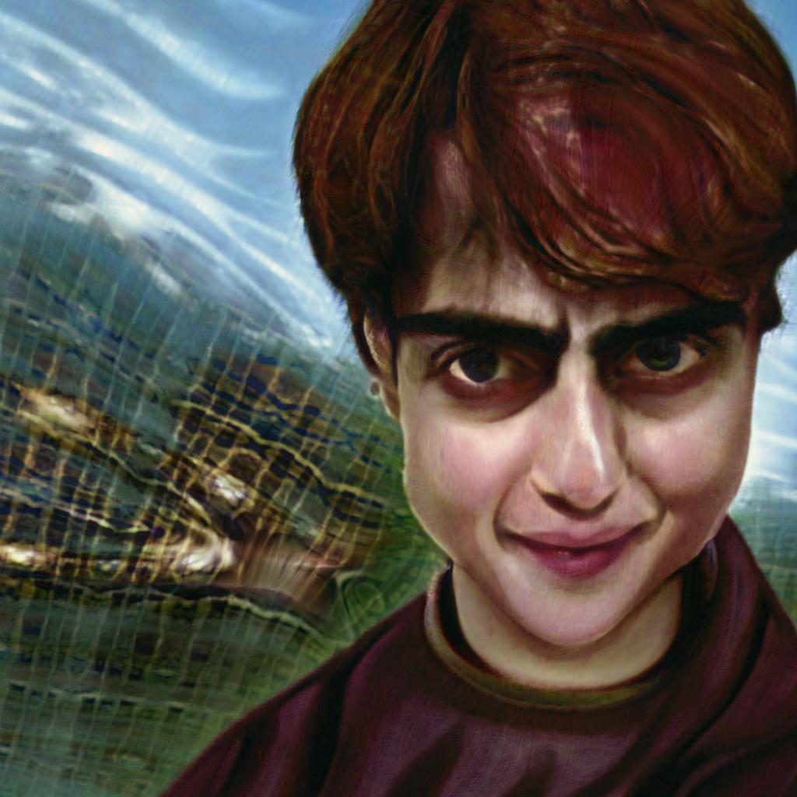

# StyleGan3+Clip as a Service

Implementation of StyleGan3+Clip using microservices (so you can use it directly)

The code is inspired by [the official paper](https://arxiv.org/abs/2107.09700) and [other resources](https://colab.research.google.com/github/ouhenio/StyleGAN3-CLIP-notebook/blob/main/StyleGAN3).

A gentle introduction to StyleGan is avaiable [here](https://machinelearningmastery.com/introduction-to-style-generative-adversarial-network-stylegan/#:~:text=The%20StyleGAN%20is%20an%20extension,images%20during%20the%20training%20process.).
## Installation

Make sure to have [docker](https://docs.docker.com/get-docker/) installed and an accessible GPU.

> git clone https://github.com/chumpblocckami/StyleGan3Clip_Service.git
> 
> cd StyleGan3Clip_Service
> 
> docker-compose up

then the service will be up and running at **http://localhost:5000**.

## Usage:

The attributes to enter are:
- *model*: the model used to perform the GAN. For more info:  [Pretrained models](https://ngc.nvidia.com/catalog/models/nvidia:research:stylegan3)
- *text*: the text to generate the style from.
- *steps*: how many cycles to perform.
- *seed*: same number will reproduce the same result.

## Results:

<table>
<tr>
    <th>MODEL</th>
    <th>TEXT</th>
    <th>STEP</th>
    <th>SEED</th>
    <th>START</th>
    <th>END</th>
    <th>TRANSITION</th>
</tr>
<tr>
    <td>FFHQ</td>
    <td>Harry Potter trading card game artwork</td>
    <td>200</td>
    <td>-</td>
    <td></td>
    <td></td>
    <td> 
        
    </td>
</tr>
</table>

